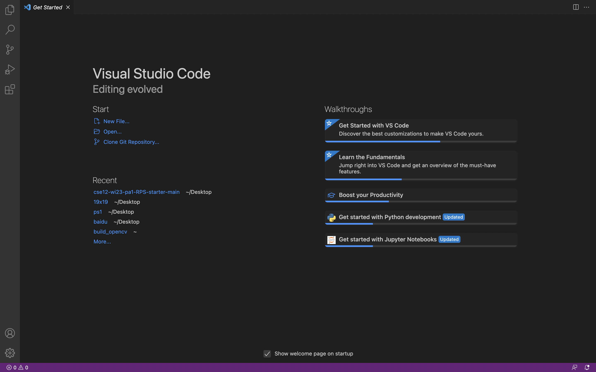
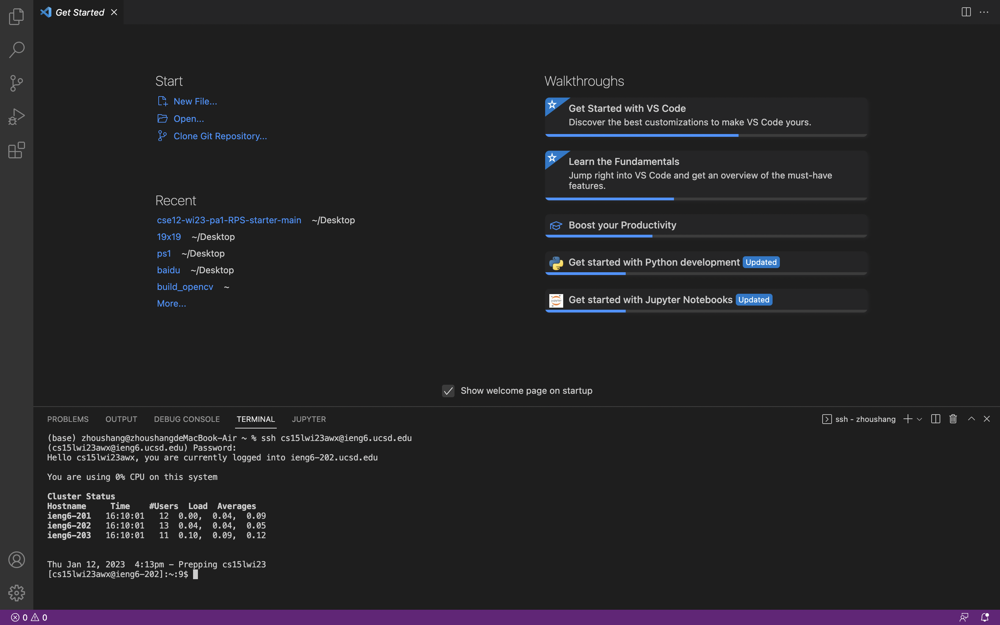
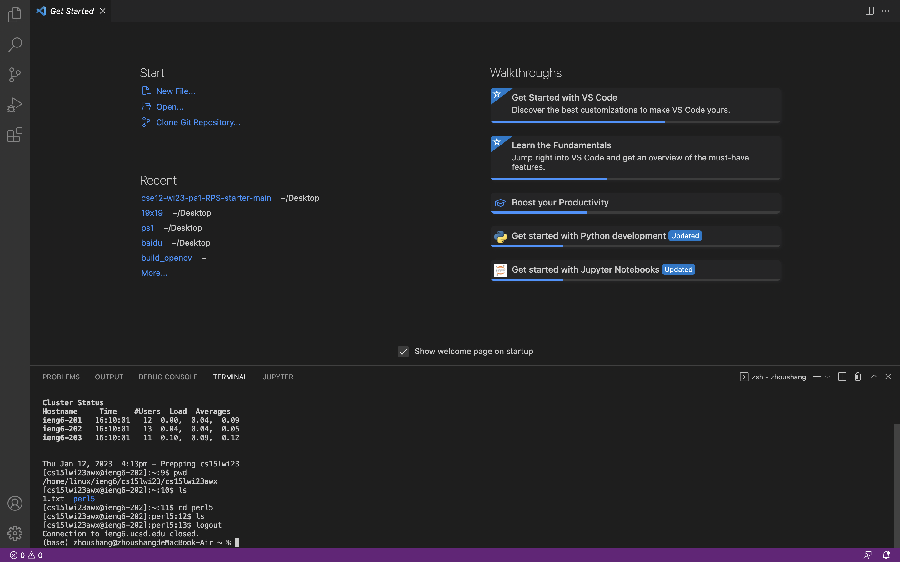

Installing VScode

I visited the Visual Studio Code website, https://code.visualstudio.com/, in accordance with the instructions to download and install it on my computer.

Remotely Connecting

I opened a terminal in VS Code. And then use the command:
$ ssh cs15lwi23awx@ieng6.ucsd.edu.
Then I typed in my password to complete the login.

Trying Some Commands

I tried different ways to run the commands cd, ls, pwd. I used Ctrl-D to log out of the remote server.
