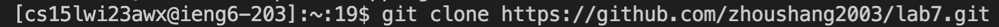
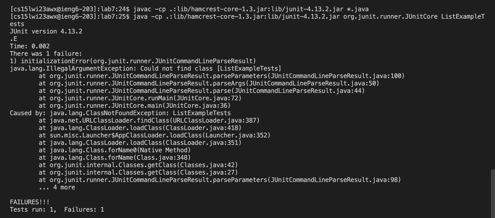
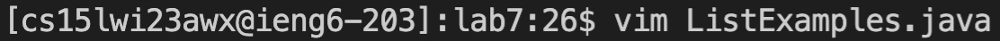
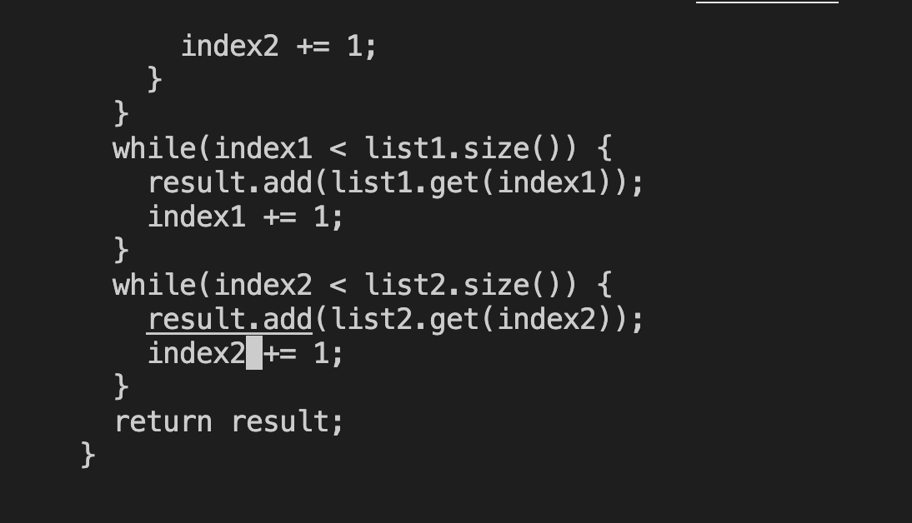
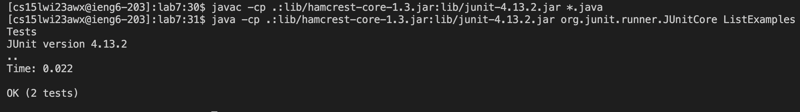
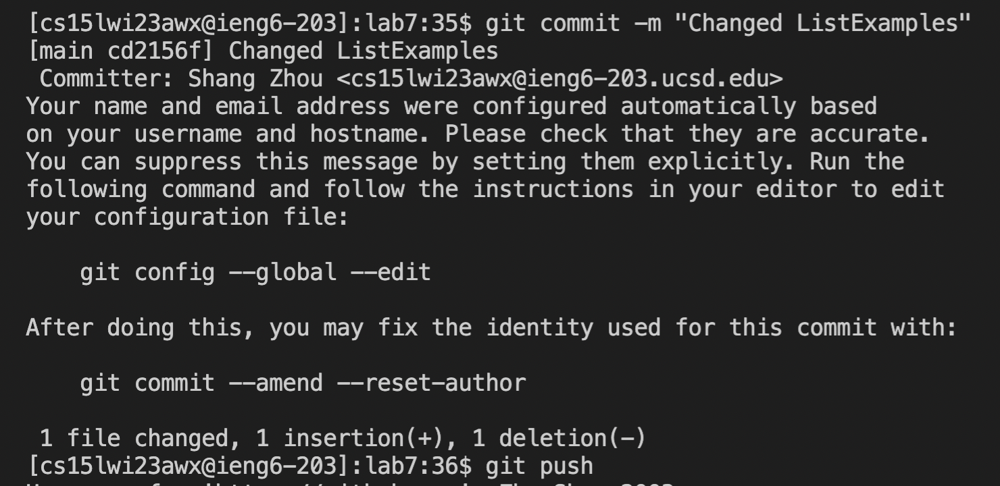

# Step 1. Log into ieng6
To log in. Typing the command `ssh cs15lwi23awx@ieng6.ucsd.edu`.(replace command with course specified name!)	

# Step 2. Clone your fork of the repository from your Github account
To fork. Copy the http link from github and type the command `git clone "link"`.

# Step 3. Run the tests, demonstrating that they fail
To test first type `cd lab7`, then copy and paste the run test command from school website. As we can tell they fail.

# Step 4. Edit the code file to fix the failing test
Using vim to fix the bug. Type `vim ListExamples.java`, press `<down>` arrow until the cursor on the second image and press `<right>` arrow until the cursor on the second image. Press `i`, press `delete` and then press `2`. Then press `esc`, press `:wq!` to change and fix the bug.

# Step 5. Run the tests, demonstrating that they now succeed
Copy and paste the commands again to run the tests and we now see they succeed.
Or instead we can use <up arrow> to traverse back to the history since we have already typed the command.

# Step 6. Commit and push the resulting change to your Github account 
Typing `git init`, then type `git add ListExamples.java` and then press `git commit -m "Changed ListExamples"`. Then type `git push` to finally push the change.

